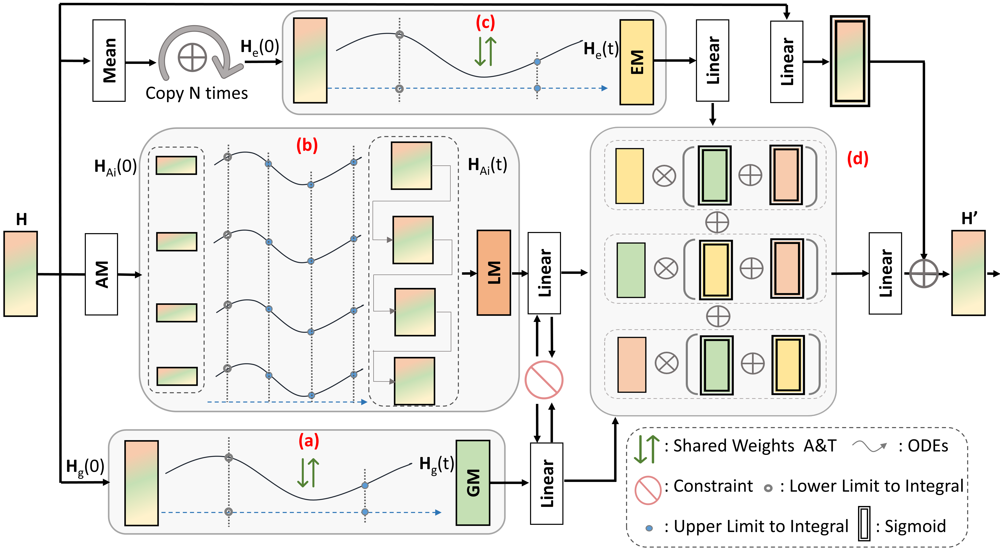

# GRAM-ODE
This is an implementation of [Graph-based Multi-ODE Neural Networks for Spatio-Temporal Traffic Forecasting](https://openreview.net/pdf?id=Oq5XKRVYpQ)


## Overview



In this paper, we propose a novel architecture called Graph-based Multi-ODE Neural Networks GRAM-ODE which is designed with multiple connective ODE-GNN modules to learn better representations by capturing different views of complex local and global dynamic spatio-temporal dependencies. We also add some techniques to further improve the communication between different ODE-GNN modules towards the forecasting task. Extensive experiments conducted on six real-world datasets demonstrate the outperformance of GRAM-ODE compared with state-of-the-art baselines as well as the contribution of different GRAM-ODE components to the overall performance.


## Run
```
python run_stode.py
```

## Requirements
* python 3.8
* torch 1.9.0+cu111
* torchdiffeq 0.2.3
* fastdtw  0.3.4

## Dataset
PEMS03, PEMS04, PEMS07, and PEMS08 already downloaded and preprocessed in ```data``` folder

PEMS-BAY and METR-LA can be downloaded here [this repo](https://github.com/chnsh/DCRNN_PyTorch/tree/pytorch_scratch/data/sensor_graph) and [this Google Drive](https://drive.google.com/drive/folders/10FOTa6HXPqX8Pf5WRoRwcFnW9BrNZEIX) 

## Reference
Please cite our paper if you use the model in your own work:
```
@article{
liugramode2023,
title={Graph-based Multi-{ODE} Neural Networks for Spatio-Temporal Traffic Forecasting},
author={Anonymous},
journal={Submitted to Transactions on Machine Learning Research},
year={2022},
url={https://openreview.net/forum?id=Oq5XKRVYpQ},
note={Under review}
}
```


